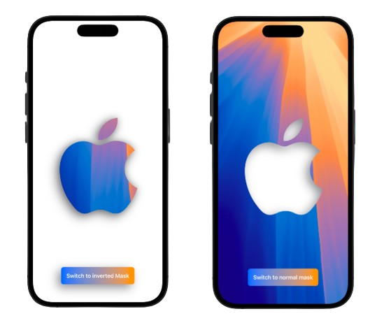

# Image Masking and Inverted Masking App

## Overview
This SwiftUI app demonstrates image masking and inverted masking techniques. Users can interact with images and apply different masking effects to see real-time changes.

## Features
- **Image Masking:** Apply custom masks to images to create unique visual effects.
- **Inverted Masking:** Use inverted masks for creative transformations.

  <div style="text-align:center;">
    
  </div>

## Installation
1. Clone the repository:
   ```bash
   git clone https://github.com/csprasad/Masking-iOS-SwiftUI
2. Open the project in Xcode.
3. Build and run the app on your simulator or device.

## Credits
Inspired by a LinkedIn post from [Learn And Code With Enid](https://www.linkedin.com/posts/learn-and-code-with-enid_masking-and-inverted-masking-in-swiftui-activity-7224713901400100864-u9to/?utm_source=share&utm_medium=member_desktop). Check them out for more great coding insights!

## Contact
For any questions or feedback, feel free to reach out via csprasad195@gmail.com.
***
Feel free to adjust any details as needed!
